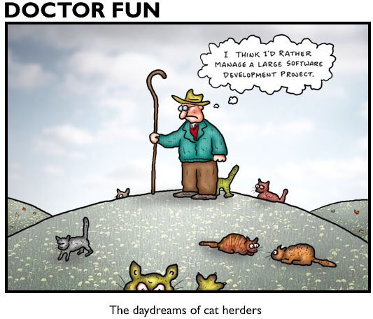

# Concrete project planning

These are things which should be written as documentation during the project development phase. Writing this alongside your Data Management Plan ([DMP](https://www.library.ucdavis.edu/service/research-data-services/plan-2/)) will help develop the overall design.

(Project planning is all about checklists. There are no cool graphics for project planning.)

## Governance

How are decisions made? Who makes them?

For large, complicated projects, decision-making responsibility can be distributed by expertise (consulting statistician, system administrator), accountability (grant PI, campus security officer), and/or authority (PI, funding source, multi-site project lead).

## Project checklist

1.  What are the **deliverables**? Code, analyses, figures, white papers, journal publications, etc. This constrains everything that follows.
2.  What is the **timetable** for the deliverables?
3.  Who are the **responsible parties** for each of the deliverables?
4.  What are the **dependencies**? For example: Data analysis requires data cleanup and validation, writing code, and testing the code.
5.  What are the **implied dependencies**?
    1.  Documentation
    2.  Testing
    3.  Backups
    4.  System administration (installation, upgrades, there\'s only one person who knows how to troubleshoot network errors, etc.)
    5.  Training

## Herding your cats

1.  By default, give everyone access to everything. If you can\'t do this, you have a new implied dependency: Security.
2.  Establish a common workflow for collaborating on code (e.g., \"we share all code in a private Github repository\")
3.  Establish a common workflow for collaborating on documents
4.  Large group? Delegate to team leads.

## Scheduling

A common conversation on development teams:

Q: \"How long will X take?\"

A: \"Four weeks\"

X is irrelevant. From this we learn that there are two kinds of schedules:

1.  Evidence-based schedules
2.  Lies

### Evidence-based scheduling

1.  Estimate task time
2.  Start the clock
3.  Complete the task
4.  Stop the clock
5.  Assess accuracy
6.  Weight new estimates

See more in [tthis blog post by Joel Spolsky](https://www.joelonsoftware.com/2007/10/26/evidence-based-scheduling/)

### Some comments on evidence-based scheduling

1.  You can estimate the task time using time or \"points\" (i.e. the relative size of tasks)
2.  Note the missing step: You don\'t stop the clock when you go off-task in (3). This is deliberate; your inability to predict interruptions is one of the major sources of estimation error.
3.  You can assess the accuracy of your schedule estimates by eyeball or by using regression, depending on your commitment to the bit.

### An aside about \"methodologies\"

There are many \"methodologies\" (Kanban, Agile, etc.). You can try them all, or just ignore them.

You have a pile of work.

1.  Try to organize the work in to bite-size chunks
2.  Try to keep track of who's doing what
3.  Try to do the important stuff first

### An aside about boiling the ocean

A common mistake is trying to build everything at once. Start small and build the code in a way that scales. Don\'t jump to the next level of complexity until you need it.

Some case and point examples:

1.  [Command line tools can be faster than your hadoop cluster](https://adamdrake.com/command-line-tools-can-be-235x-faster-than-your-hadoop-cluster.html)
2.  [Cleaning DNA sequences with R and AWK](https://livefreeordichotomize.com/2019/06/04/using_awk_and_r_to_parse_25tb/)
